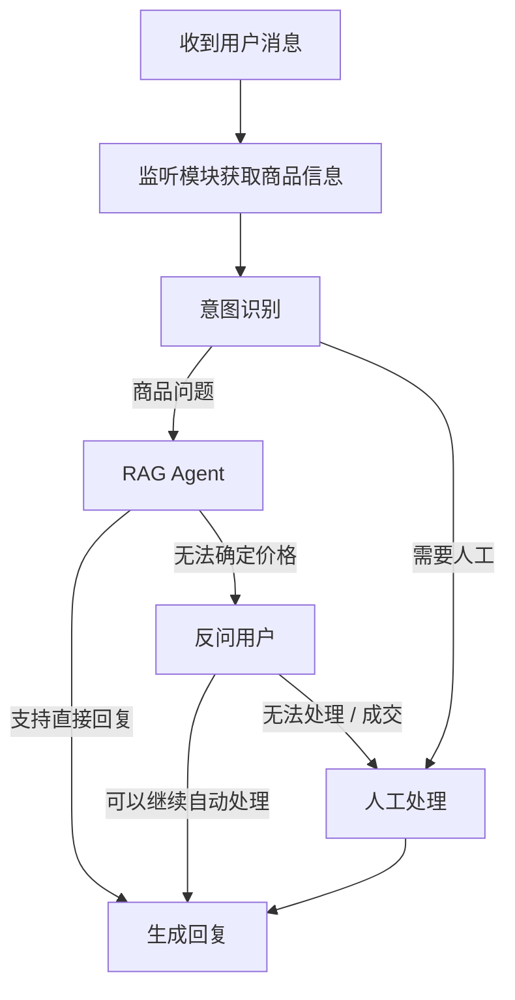
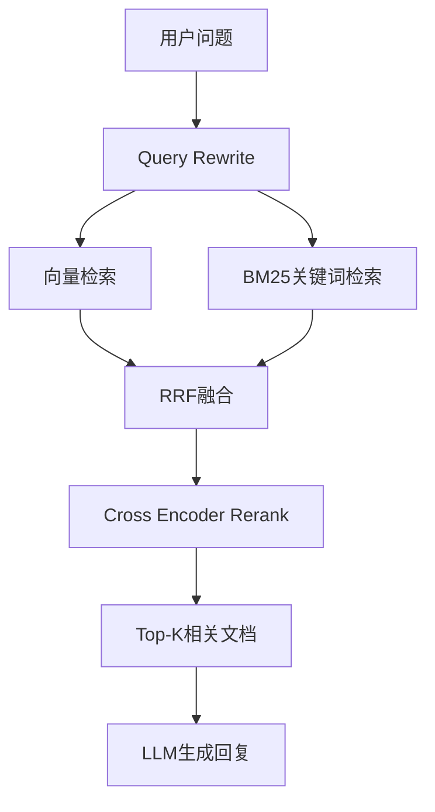

# Idlefish Intelligent Customer Service Agent

基于 **LangGraph + LangChain + RAG + FastAPI + MySQL + Redis** 构建的闲鱼智能客服 Agent。


项目通过监听闲鱼聊天消息，自动识别用户意图、匹配商品信息，并结合商品知识库进行检索，在满足条件时生成商品相关回复；对于无法自动处理或需要人工介入的情况，支持转人工处理。

> 本项目为个人电商副业场景设计并开发的智能客服 Agent，目前已完成核心功能开发

---

## 1. 项目简介

传统电商客服需要人工根据用户问题查询商品信息并进行回复，处理效率较低。

本项目构建一个面向闲鱼场景的智能客服 Agent，将：

* 消息监听
* 商品识别
* 意图识别
* RAG 知识库检索
* Agent 决策
* Redis 缓存
* MySQL 持久化
* FastAPI 服务

结合起来，实现一个具有自主决策能力的智能客服系统。

系统能够根据用户当前问题判断是否需要查询知识库，并在检索结果不足或需要人工处理时进入对应流程。

---

## 2. 系统架构



## 3. RAG流程

用户发送消息后，RAG内部处理流程如下：



---

## 4. 核心功能

### 4.1 消息监听

通过 UI Automation 获取闲鱼聊天窗口中的消息，并将用户消息传递给 Agent。

监听模块主要负责：

* 获取聊天消息
* 获取商品相关信息
* 获取用户名
* 商品匹配
* 将消息,商品名称,用户名称传递给后端 Agent

---

### 4.2 意图识别

使用 LangGraph 构建状态流，根据用户消息判断当前请求类型。

目前主要包括：

* `rag_agent`：商品知识库助手
* `human`：人工处理

Agent 根据不同意图进入对应处理流程。

---

### 4.3 RAG 知识库

项目中的商品知识库来源于 Excel 商品数据。

数据处理流程：

```text
                     Excel
                      ↓
                    数据清洗
                      ↓
                  结构化数据
                      ↓
                   Document
                  ↙         ↘
            Embedding       分词
                ↓             ↓
           VectorStore      BM25 Index
```

知识库主要用于保存商品型号规格、价格、最低价格、产品质保及快递配送等相关信息。

> 由于原始 Excel 数据属于项目使用的业务数据，因此未上传至 GitHub。

---

## 5. RAG 检索方案

为了提高商品信息检索的准确性，项目没有只使用单一向量检索，而是采用**混合检索 + Rerank**方案。

### 5.1 Query Rewrite

首先对用户原始问题进行查询优化，将自然语言问题转换成更适合知识库检索的查询。

```text
用户问题
   ↓
Query Rewrite
   ↓
优化后的 Query
```

---

### 5.2 Vector Search

使用 Embedding 将查询转换为向量，并从向量数据库中检索语义相关的商品文档。

用于解决：

> 用户表达方式与知识库文本不完全一致的问题。

---

### 5.3 BM25

同时使用 BM25 进行关键词检索。

BM25 对：

* 商品型号
* 产品名称
* 特定关键词

等精确匹配场景具有较好的效果。

---

### 5.4 RRF Fusion

将向量检索与 BM25 的结果进行融合：

```text
Vector Search
      │
      ├──────┐
      │      │
      ▼      ▼
RRF
      ▲      ▲
      │      │
BM25 Search
```

通过 Reciprocal Rank Fusion 对多个检索结果进行统一排序。

---

### 5.5 Cross Encoder Rerank

经过 RRF 融合后，再使用 Cross Encoder 对 Query 与候选文档进行重新排序。

整体检索流程：

```text
User Query
    ↓
Query Rewrite
    ↓
┌─────────────┬─────────────┐
│ Vector      │ BM25        │
│ Retrieval   │ Retrieval   │
└──────┬──────┴──────┬──────┘
       │             │
       └──────┬──────┘
              ↓
          RRF Fusion
              ↓
       Cross Encoder
          Rerank
              ↓
        Top Documents
              ↓
             LLM
```

---

## 6. Agent 设计

项目使用 **LangGraph** 管理 Agent 工作流。

核心 State 包括：

```text
messages
intent
product_info
```

Context 用于传递请求级上下文，例如：

```text
product_id
user_id
```

Agent 可以根据检索结果和当前上下文决定后续处理方式，而不是简单地通过固定规则串联所有模块。

---

## 7. Redis 缓存

项目使用 Redis 对部分检索结果进行缓存。

基本流程：

```text
Product_Id + User_Query
    ↓
生成 Cache Key
    ↓
Redis 查询
    │
    ├── Hit → 直接返回缓存结果
    │
    └── Miss
          ↓
       RAG Retrieval
          ↓
       保存 Cache
          ↓
       返回结果
```

用于减少重复查询带来的计算和模型调用开销。

---

## 8. MySQL 持久化

项目使用 MySQL 作为 LangGraph Checkpointer 的持久化存储。

用于保存 Agent 执行过程中的 checkpoint 数据，使 Agent 状态能够在不同请求之间进行持久化。

数据库由 LangGraph 自动创建相关 checkpoint 表。

---

## 9. FastAPI

使用 FastAPI 提供后端接口，将 Agent 能力封装为 HTTP API。

整体结构：

```text
Listener / Client
       ↓
    FastAPI
       ↓
   LangGraph
       ↓
      Agent
       ↓
      RAG
```

---

## 10. 技术栈

| 技术            | 用途                  |
| ------------- | ------------------- |
| Python        | 后端开发                |
| LangGraph     | Agent 工作流与状态管理      |
| LangChain     | LLM / Tool / RAG 集成 |
| FastAPI       | API 服务              |
| Redis         | 缓存                  |
| MySQL         | Agent 状态持久化         |
| Chroma        | 向量数据库               |
| BM25          | 关键词检索               |
| RRF           | 多路检索结果融合            |
| Cross Encoder | 检索结果重排序             |
| Embedding     | 文本向量化               |
| UI Automation | 闲鱼消息监听              |

---

## 11. 项目结构

```text
Idlefish_agent/
│
├── app/
│   ├── agent/
│   │   ├── context.py
│   │   ├── graph.py
│   │   ├── model.py
│   │   ├── node.py
│   │   ├── prompt.py
│   │   ├── rag_agent.py
│   │   └── state.py
│   │
│   ├── cache/
│   │   └── cache.py
│   │
│   ├── common/
│   │   └── logger.py
│   │
│   ├── models/
│   │   └── session.py
│   │
│   ├── rag/
│   │   ├── index.py
│   │   ├── loader.py
│   │   ├── retriever.py
│   │   └── version.py
│   │
│   └── main.py
│
├── listener/
│   ├── listener.py
│   ├── main.py
│   ├── message.py
│   ├── product_matcher.py
│   └── ui.py
│
├── .gitignore
├── pyproject.toml
└── uv.lock
```

---


## 12. 🚀项目运行

### 13.1 环境要求
Windows
Python 3.12+
uv
MySQL 8.4+
Memurai

### 12.2 配置环境变量

在项目根目录创建 .env 文件：

DASHSCOPE_API_KEY=your_api_key
DEEPSEEK_API_KEY=your_api_key

DB_URL=your_database_url

REDIS_HOST=localhost
REDIS_PORT=6379

根据实际使用的模型和数据库配置填写对应参数。

### 12.3 安装项目依赖

进入项目根目录：

uv sync

### 12.4 初始化基础服务

启动项目之前，请确保：

MySQL 服务已启动
Memurai 服务已启动
.env 配置正确

MySQL 用于持久化 LangGraph Checkpoint，Memurai 用于缓存。

### 12.5 一键启动

项目提供 Windows 一键启动脚本：

start.bat

直接双击 start.bat 即可。

启动后会分别打开：

FastAPI
Listener

其中：

FastAPI：提供 Agent HTTP API 服务
Listener：监听闲鱼聊天窗口并获取用户消息及商品信息
Memurai：提供 Redis 兼容的缓存服务

### 12.6 手动启动

如果不使用一键启动，也可以分别运行：

启动 FastAPI：

uv run python app/main.py

启动 Listener：

uv run python -m listener.main

FastAPI 默认运行：

http://127.0.0.1:8001

---

## 14. 个人贡献

本项目为个人独立开发项目，主要负责：

- 基于 LangGraph 设计 Agent 工作流及 State / Context 结构
- 实现 Agent 节点、Tool 及状态流转
- 完成 Excel 商品数据清洗及 Document 构建
- 构建 BM25 + Vector Search 混合检索方案
- 实现 RRF 检索结果融合及 Cross Encoder Rerank
- 使用 Redis 实现检索结果缓存
- 使用 MySQL 实现 LangGraph Checkpoint 持久化
- 使用 FastAPI 封装 Agent 服务接口
- 实现基于 UI Automation 的闲鱼消息监听及商品信息匹配

---

## 15. 后续计划

* 增加售后板块
* 增加产品优惠板块
* 完善异常处理与日志系统

